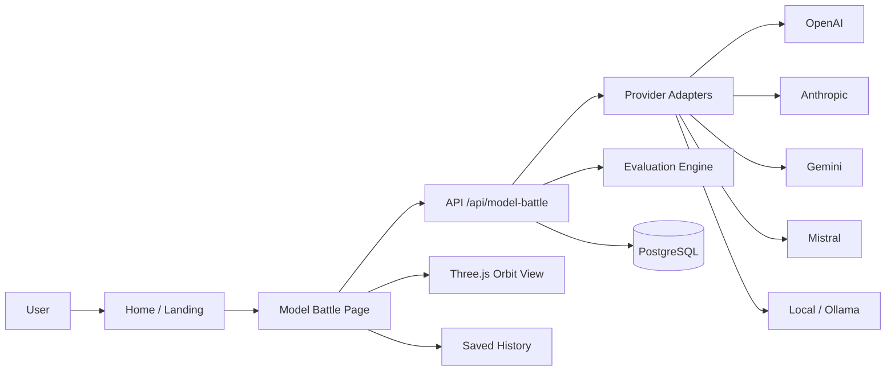

# AI Music X-Ray

AI Music X-Ray is a portfolio-grade Next.js music intelligence platform that compares multiple model opinions on the same Spotify track, scores their grounding, and visualizes the disagreement.

It still preserves the original demo-friendly visualizer flow, but now adds:

- a multi-provider AI abstraction layer
- normalized track analysis input shared across all models
- structured JSON model output with Zod validation
- deterministic evaluation scores and comparison summaries
- a saved analysis history backed by PostgreSQL tables
- a new AI Model Comparison page for side-by-side review

## Tech stack

- Next.js App Router and TypeScript
- Tailwind CSS
- React Three Fiber and Three.js
- Spotify Web API and Spotify Web Playback SDK
- PostgreSQL persistence
- Provider adapters for OpenAI, Anthropic, Gemini, Mistral, and Ollama
- Server-side Zod validation and deterministic evaluation

## Architecture



## Local setup

```bash
npm install
cp .env.example .env.local
npm run db:apply
npm run dev
```

Open `http://localhost:3000`.

If your local Postgres container is not already running, start it first with:

```bash
docker compose up -d postgres
```

## Environment variables

Required for Spotify auth and database persistence:

```bash
SPOTIFY_CLIENT_ID="..."
SPOTIFY_CLIENT_SECRET="..."
NEXT_PUBLIC_APP_URL="http://localhost:3000"
SPOTIFY_REDIRECT_URI="http://localhost:3000/api/spotify/callback"
DATABASE_URL="postgres://..."
```

Optional model provider flags:

```bash
OPENAI_API_KEY=""
ANTHROPIC_API_KEY=""
GEMINI_API_KEY=""
MISTRAL_API_KEY=""
OLLAMA_BASE_URL="http://localhost:11434"
OLLAMA_MODEL="llama3.1"
AI_PROVIDER_OPENAI="false"
AI_PROVIDER_ANTHROPIC="false"
AI_PROVIDER_GEMINI="false"
AI_PROVIDER_MISTRAL="false"
AI_PROVIDER_OLLAMA="false"
```

The provider flags allow you to enable or disable adapters without exposing secrets to the client.

## Local Llama

To use Ollama as the local Llama fallback:

```bash
ollama pull llama3.1
ollama serve
```

Then set:

```bash
OLLAMA_BASE_URL="http://localhost:11434"
OLLAMA_MODEL="llama3.1"
AI_PROVIDER_OLLAMA="true"
```

Leave the cloud provider flags off if you want to compare against local Llama only.

## Key routes

- `/` landing page
- `/app` real-time visualizer
- `/model-battle` AI model comparison dashboard
- `/history` saved analysis history section inside the comparison experience
- `/spotify-history` Spotify recent-play JSON viewer

## Database schema

See `db/002_ai_music_intelligence_platform.sql` for the required tables:

- `analysis_runs`
- `model_outputs`
- `evaluation_scores`
- `track_snapshots`
- `provider_logs`

## Screenshots

Add portfolio screenshots here once you capture them:

- `docs/screenshots/home.png`
- `docs/screenshots/model-battle.png`
- `docs/screenshots/history.png`

## Notes

- Demo mode still works when Spotify or provider keys are missing.
- The server keeps secrets out of the client bundle.
- The model comparison workflow uses the same structured input for every provider.
- If Postgres is not configured, the history API falls back to an empty result set.

## Verification

```bash
npm run lint
npm run build
```

## Roadmap

- wire a real lyrics provider adapter
- add more judge-model scoring options
- persist richer run metadata and prompt versions
- add authenticated user-specific comparison history
